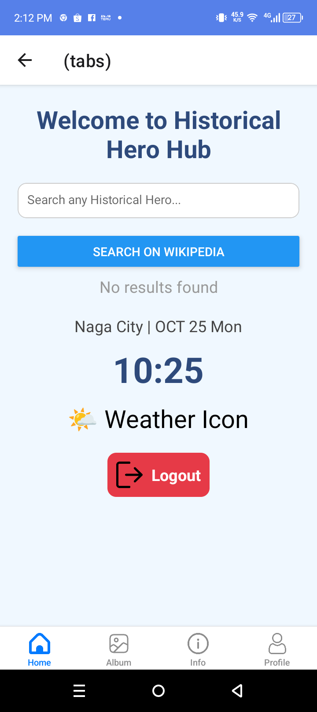
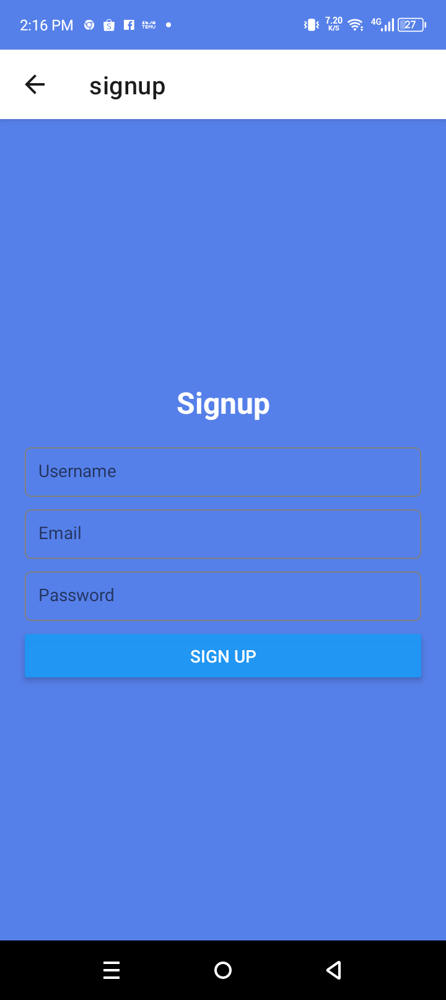
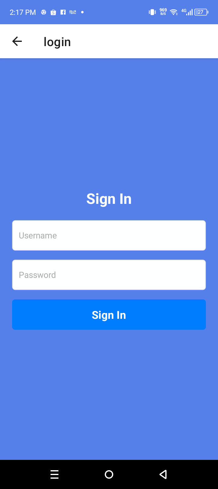

# History App
    History App App.

# Features
* Timeline View
* Historical Events Database
* Interactive Maps
* Historical Figures Profiles

# Course Overview
* Mesopotamia and the first cities
* Early innovations in writing, agriculture, and law
* The Italian Renaissance and the rebirth of art
* Evaluate how these movements shaped the modern world

# Tech Stack
* React Native
* AppWrite
* HTML, CSS and JS

# Home Screen
  

# Sign Up Screen
  

# Sign In Screen
  

# Tabs Screen
  
